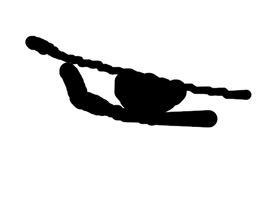

<p align="center"> 
 
</p>


# Freeview.js is A Javascript Library to Preview Image
--------------------------------------------

<p align="center">
 <a href="https://github.com/fauzan121002/freeviewjs/LICENSE">
  
 </a>

 <a href="https://github.com/fauzan121002/freeviewjs">
  
 </a>
</p>

<p align="center">
 <a href="https://github.com/fauzan121002/freeviewjs/issues">
  
 </a>

 <a href="https://github.com/fauzan121002/freeviewjs">
  
 </a>

 <a href="https://github.com/fauzan121002/freeviewjs">
  
 </a>
</p>

--------------------------------------------
## Table of Contents

* [Usage](#usage)
* [Contributing](#contributing)
* [License](#license)

## Usage
You can see the example usage <a href="https://github.com/fauzan121002/freeviewjs/blob/master/example/index.html">here</a>

### How to use
You can import the script inside the body tag.
```html
 <!DOCTYPE html>
<html lang="en">
<head>
    <meta charset="UTF-8">
    <meta name="viewport" content="width=device-width, initial-scale=1.0">
    <title>Freeviewjs</title>
</head>
<body>

    <script src="https://raw.githubusercontent.com/fauzan121002/freeviewjs/master/freeview.js"></script>
</body>
</html>
```

### Preview
The default function is Asynchronous so you need to specify that with async await.
```js
    await preview("img","inputphoto",0);
```
##### Parameters :
* First Parameter : The image element.
* Second Parameter : The input type file element.
* Third Parameter : The input type file files index were uploaded.

#### Note : Parameter 0 and 1 refer to ID tag.

### Synchronous Preview
If you do not need to use asynchronous you can also use synchronous function
```js
    previewSync("img","inputphoto",0);
```

### Reset uploaded file
You can reset uploaded file in an element by calling function with argument which input type file id on it.
```js
    reset("inputphoto");
```
or you can also reset all which support multiuploaded files.
```js
    resetAll();
```

## Contributing
You can create new pull requests <a href="https://github.com/fauzan121002/freeviewjs/pulls">here</a>

## License
This javascript library is published under <a href="https://github.com/fauzan121002/freeviewjs/blob/master/LICENSE">MIT License</a>
